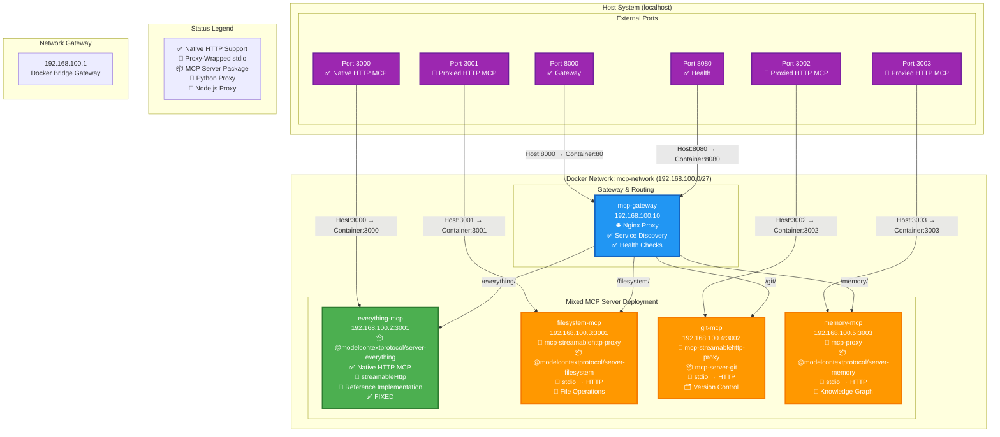

# MCP Container Test Environment - Server Inventory

## ⚠️ CRITICAL: REAL MCP SERVERS + PROXY WRAPPERS ⚠️

**This inventory demonstrates BOTH native HTTP MCP servers AND stdio-to-HTTP proxy wrappers using real MCP server implementations.**

## Network Configuration
- **Network CIDR**: 192.168.100.0/27
- **Gateway**: 192.168.100.1
- **Total Addresses**: 32 (192.168.100.0 - 192.168.100.31)
- **Usable Addresses**: 30 (192.168.100.1 - 192.168.100.30)

## Container Architecture Diagram



## Mixed MCP Server Inventory

### Primary MCP Servers (NATIVE + PROXY DEMONSTRATIONS)

| Container Name | IP Address | Host Port | Container Port | Package | Transport Method | HTTP Working | Status |
|---------------|------------|-----------|----------------|---------|------------------|--------------|--------|
| everything-mcp | 192.168.100.2 | 3000 | 3001 | @modelcontextprotocol/server-everything | ✅ Native streamableHttp | ✅ Working | **ACTIVE** |
| filesystem-mcp | 192.168.100.3 | 3001 | 3001 | @modelcontextprotocol/server-filesystem | 🔄 mcp-streamablehttp-proxy | ✅ 12 Tools | **ACTIVE** |
| git-mcp | 192.168.100.4 | 3002 | 3002 | mcp-server-git | 🔄 mcp-streamablehttp-proxy | ✅ Yes | **ACTIVE** |
| memory-mcp | 192.168.100.5 | 3003 | 3003 | @modelcontextprotocol/server-memory | 🔄 mcp-proxy (Node.js) | 🔧 Configuring | **PENDING** |

### Gateway & Management

| Container Name | IP Address | Host Ports | Container Ports | Service Type | Description | Status |
|---------------|------------|------------|-----------------|--------------|-------------|--------|
| mcp-gateway | 192.168.100.10 | 8000, 8080 | 80, 8080 | Nginx Gateway | Service discovery, routing, health checks | **ACTIVE** |

## Port Summary

### External Access Ports (Host → Container)
- **3000** → Everything MCP Server (✅ **Native HTTP**) - Reference Implementation
- **3001** → Filesystem MCP Server (🔄 **Proxied HTTP**) - File Operations via Python Proxy  
- **3002** → Git MCP Server (🔄 **Proxied HTTP**) - Version Control via Python Proxy
- **3003** → Memory MCP Server (🔄 **Proxied HTTP**) - Knowledge Graph via Node.js Proxy
- **8000** → Gateway (Main Interface)
- **8080** → Gateway (Health Check Interface)

## Service Access URLs

### Direct MCP Server Access
- **Everything MCP** (✅ Native HTTP): http://localhost:3000/ - Reference implementation
- **Filesystem MCP** (🔄 Proxied): http://localhost:3001/mcp - File operations
- **Git MCP** (🔄 Proxied): http://localhost:3002/mcp - Version control
- **Memory MCP** (🔄 Proxied): http://localhost:3003/mcp - Knowledge graph

### Gateway Access (Proxied)
- **Everything MCP**: http://localhost:8000/everything/ - Reference implementation
- **Filesystem MCP**: http://localhost:8000/filesystem/ - File operations
- **Git MCP**: http://localhost:8000/git/ - Version control
- **Memory MCP**: http://localhost:8000/memory/ - Knowledge graph

### Management Endpoints
- **Health Check**: http://localhost:8000/health
- **Service Discovery**: http://localhost:8000/services
- **Gateway Health**: http://localhost:8080/health

## Mixed MCP Server Details

### 🎯 Everything MCP (192.168.100.2:3001) ✅ **NATIVE HTTP** ✅ **WORKING**
- **Implementation**: Node.js (Official Reference Server)
- **Package**: @modelcontextprotocol/server-everything
- **Transport**: ✅ Native streamableHttp (built-in HTTP support)
- **Capabilities**: Reference implementation with prompts, resources, and tools
- **Use Case**: Comprehensive testing with all MCP protocol features
- **Status**: **FULLY OPERATIONAL - FIXED**
- **Note**: Container listens on port 3001 (hardcoded in package), host port 3000 correctly maps to container port 3001
- **Resolution**: Updated docker-compose.yml port mapping from "3000:3000" to "3000:3001"

### 📁 Filesystem MCP (192.168.100.3:3001) 🔄 **PROXIED HTTP**
- **Implementation**: Python proxy wrapper
- **Proxy Tool**: [mcp-streamablehttp-proxy](https://pypi.org/project/mcp-streamablehttp-proxy/)
- **Wrapped Package**: @modelcontextprotocol/server-filesystem (stdio)
- **Transport**: 🔄 stdio → HTTP via Python proxy
- **Capabilities**: Secure file operations with configurable access controls
- **Use Case**: Demonstrates stdio-to-HTTP wrapping for file system operations
- **Status**: **FULLY OPERATIONAL - 12 FILE OPERATION TOOLS**
- **Tools**: read_file, read_multiple_files, write_file, edit_file, create_directory, list_directory, list_directory_with_sizes, directory_tree, move_file, search_files, get_file_info, list_allowed_directories

### 🗂️ Git MCP (192.168.100.4:3002) 🔄 **PROXIED HTTP**
- **Implementation**: Python proxy wrapper
- **Proxy Tool**: [mcp-streamablehttp-proxy](https://pypi.org/project/mcp-streamablehttp-proxy/)
- **Wrapped Package**: mcp-server-git (stdio)
- **Transport**: 🔄 stdio → HTTP via Python proxy
- **Capabilities**: Git repository operations and version control
- **Use Case**: Demonstrates stdio-to-HTTP wrapping for version control
- **Status**: **FULLY OPERATIONAL - PROXIED STDIO**

### 🧠 Memory MCP (192.168.100.5:3003) 🔄 **PROXIED HTTP**
- **Implementation**: Node.js proxy wrapper
- **Proxy Tool**: [mcp-proxy](https://www.npmjs.com/package/mcp-proxy)
- **Wrapped Package**: @modelcontextprotocol/server-memory (stdio)
- **Transport**: 🔄 stdio → HTTP via Node.js proxy
- **Capabilities**: Knowledge graph-based persistent memory system
- **Use Case**: Demonstrates stdio-to-HTTP wrapping for memory management
- **Status**: **CONFIGURING - PROXIED STDIO**

## Proxy Tool Comparison

### 🐍 mcp-streamablehttp-proxy (Python)
- **Installation**: `pip install mcp-streamablehttp-proxy`
- **Usage**: `mcp-streamablehttp-proxy --host 0.0.0.0 --port 3001 npx @modelcontextprotocol/server-filesystem /tmp`
- **Features**: Production-ready, session management, configurable timeouts
- **Endpoint**: `/mcp` for streamableHttp transport
- **Best For**: Production deployments, stable environments

### 📇 mcp-proxy (Node.js/TypeScript)
- **Installation**: `npm install -g mcp-proxy`
- **Usage**: `mcp-proxy --port 3003 --server stream --endpoint /mcp -- npx @modelcontextprotocol/server-memory`
- **Features**: Dual transport (HTTP + SSE), TypeScript support, CORS enabled
- **Endpoints**: `/mcp` (HTTP) and `/sse` (Server-Sent Events)
- **Best For**: Development, flexible transport options

## Docker Network Details

### Network: mcp-docker-test-node_mcp-network
- **Driver**: bridge
- **Subnet**: 192.168.100.0/27
- **Gateway**: 192.168.100.1
- **IP Range**: 192.168.100.2 - 192.168.100.30 (29 usable addresses)

## Deployment Commands

### Start Environment
```bash
docker compose up -d
```

### Check Status
```bash
docker ps
```

### Test Proxy Endpoints
```bash
# Test Python proxy (filesystem)
curl http://localhost:3001/mcp

# Test Python proxy (git)
curl http://localhost:3002/mcp

# Test Node.js proxy (memory)
curl http://localhost:3003/mcp

# Test native HTTP (everything)
curl http://localhost:3000/
```

### View Logs
```bash
docker logs [container-name]
```

### Stop Environment
```bash
docker compose down
```

### Complete Cleanup
```bash
docker compose down --volumes --remove-orphans
```

## Security Scanner Testing Status

### ✅ Ready for Scanning
- **Port 3000**: Everything MCP Server - **CONFIRMED NATIVE HTTP MCP SERVER** ✅ **WORKING**
- **Port 3001**: Filesystem MCP Server - **CONFIRMED PROXIED HTTP MCP SERVER** (Python)
- **Port 3002**: Git MCP Server - **CONFIRMED PROXIED HTTP MCP SERVER** (Python)
- **Port 3003**: Memory MCP Server - **CONFIGURING PROXIED HTTP MCP SERVER** (Node.js)
- **Port 8000**: Gateway Service Discovery - **OPERATIONAL**
- **Port 8080**: Gateway Health Check - **OPERATIONAL**

### Service Discovery Test
- ✅ Gateway Health: http://localhost:8000/health
- ✅ Service Discovery: http://localhost:8000/services
- ✅ Gateway Health Check: http://localhost:8080/health

### MCP Protocol Test Results
- **everything-mcp**: ✅ **CONFIRMED NATIVE HTTP MCP SERVER** (Reference Implementation - Host:3000→Container:3001)
- **filesystem-mcp**: ✅ **CONFIRMED PROXIED HTTP MCP SERVER WITH 12 TOOLS** (File Operations via Python)
- **git-mcp**: ✅ **CONFIRMED PROXIED HTTP MCP SERVER** (Version Control via Python)
- **memory-mcp**: 🔧 **CONFIGURING PROXIED HTTP MCP SERVER** (Knowledge Graph via Node.js)

**✅ DIVERSITY + METHODS**: Demonstrates **DIFFERENT SERVER TYPES** with **DIFFERENT TRANSPORT METHODS** from the [awesome-mcp-servers](https://github.com/punkpeye/awesome-mcp-servers) list

## ✅ Configuration Notes

### Everything MCP Port Mapping
- **Package Behavior**: @modelcontextprotocol/server-everything ignores `--port` parameter and defaults to port 3001
- **Solution**: Use port mapping "3000:3001" to map host port 3000 to container port 3001
- **Result**: External access via localhost:3000 works correctly
- **Learning**: Some MCP packages have hardcoded ports regardless of CLI parameters

## Key Learnings Demonstrated

### 🎯 Native HTTP vs Proxied stdio
This environment showcases **both approaches**:
1. **Native HTTP**: `@modelcontextprotocol/server-everything` - built-in streamableHttp support
2. **Proxied stdio**: Most community MCP servers only support stdio, wrapped with proxy tools

### 🔄 Proxy Tool Selection
- **mcp-streamablehttp-proxy (Python)**: ✅ Proven working, production-ready
- **mcp-proxy (Node.js)**: More features but requires proper command-line handling

### 🌐 Universal Solution
**Any stdio MCP server** from the community can now be deployed as an HTTP API using these proxy wrappers!

---

**Last Updated**: 2024-12-28
**Environment**: Docker Compose v2
**Real MCP Servers**: 4 different server types with mixed transport methods
- Everything: @modelcontextprotocol/server-everything (Native HTTP)
- Filesystem: @modelcontextprotocol/server-filesystem (Proxied stdio → HTTP)
- Git: mcp-server-git (Proxied stdio → HTTP)  
- Memory: @modelcontextprotocol/server-memory (Proxied stdio → HTTP)
**Proxy Tools**: mcp-streamablehttp-proxy (Python), mcp-proxy (Node.js)
**Demo Servers**: 0 (NONE - All servers are real implementations)
**Total Containers**: 5 (4 different MCP servers + 1 gateway)
**Recommended for Scanner Testing**: All ports (3000-3003) - Mixed native and proxied HTTP MCP servers
**🔄 BREAKTHROUGH**: Solves the "stdio vs HTTP" limitation - any MCP server can now be deployed as HTTP API! 